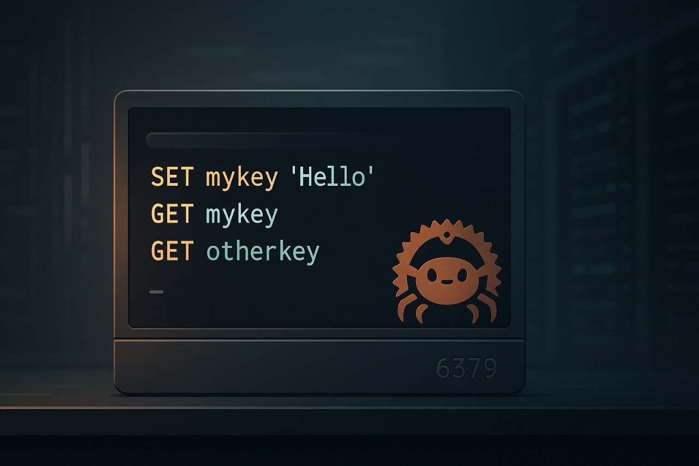

# 🔥 A Redis-Inspired Server in Rust (Async + Pub/Sub Ready)

<p align="center">
  
</p>

**rizzlerdb** is a lightweight, high-performance Redis-like server built from the ground up in Rust.

No frameworks. No shortcuts. Just raw TCP, a hand-crafted RESP protocol parser, and deep control over memory and concurrency using Tokio. Designed for learning, performance, and backend mastery.

---

🚀 **Architecture Overview**

- 🤩 Clients connect over raw TCP on port `6379`
- 🥵 Each connection is handled asynchronously via Tokio tasks
- 🧠 Commands are parsed with a custom-built RESP protocol parser
- 🧱 Shared state is managed with an `Arc<Mutex<_>>`-based central `Database`
- 📂 All mutations are persisted using a pluggable `Persister` trait
  - Default: `JsonPersister`, writing to `db.json`
- 🔄 On startup, previous state is rehydrated from disk
- 📣 Full support for Pub/Sub using async channel broadcasting

---

✅ **Implemented Features**

### ☑ Infrastructure

- [x] Async TCP server using Tokio
- [x] Manual RESP parser (zero dependencies)
- [x] In-memory storage with `HashMap`, `Vec`, and other core types
- [x] Multithreaded, safe concurrency with Tokio + `Arc<Mutex<_>>`
- [x] Background expiry workers for keys with TTL
- [x] Auto persistence via `JsonPersister`
- [x] Disk hydration at boot
- [x] Real-time Pub/Sub system

### ☑ Supported Commands

#### 🧠 String Operations
`PING`, `ECHO`, `SET`, `GET`, `DEL`, `EXISTS`, `INCR`, `INCRBY`, `DECR`, `DECRBY`

#### ⏳ Expiry & TTL
`EXPIRE`, `TTL`, `PERSIST`

#### 🧺 List Operations
`LPUSH`, `RPUSH`, `LPOP`, `RPOP`, `LRANGE`, `LLEN`, `LINDEX`, `LSET`

#### 📐 Set Operations
`SADD`, `SREM`, `SMEMBERS`, `SISMEMBER`, `SCARD`

#### 💃 Hash Operations
`HSET`, `HGET`, `HDEL`, `HKEYS`, `HVALS`, `HGETALL`, `HEXISTS`, `HLEN`

#### 📡 Pub/Sub
`PUBLISH`, `SUBSCRIBE` — instant message delivery across clients

#### 🔍 Miscellaneous
`KEYS` with basic pattern matching

---

📂 **Running Locally**

Start the server:
```bash
cargo run
```

Connect using the Redis CLI:
```bash
redis-cli -p 6379
```

Sample session:
```redis
> SET name gigachad
> GET name
> INCR count
> LPUSH queue task1
> HSET user name yash
> SUBSCRIBE news
> PUBLISH news "the backend villain strikes again"
```

---

🔮 **Planned Enhancements**

- [ ] Advanced Pub/Sub features (patterns, multi-channel, unsubscribe)
- [ ] Config file support (e.g., custom ports, persistence settings)
- [ ] Key eviction strategies (LRU / LFU)
- [ ] RDB-style memory snapshots
- [ ] AOF-style persistence (append-only)

---

🤔 **Motivation**

Redis is a cornerstone of high-performance backend architecture. Rust offers powerful tools for safe concurrency, low-level control, and memory safety. Building rizzlerdb merges both worlds, delivering a hands-on learning journey through network programming, protocol design, persistence strategies, and async architectures.

This isn’t just a clone. It’s a deep dive. A backend developer's training ground.

---

📌 **Repository**

GitHub: [github.com/pixperk/redis_in_rust](https://github.com/pixperk/redis_in_rust)

---

🙏 **Acknowledgements**

- Redis Official Documentation
- RESP Protocol Specification
- Tokio and the broader Rust community

---

Star it ⭐ | Fork it 🍴 | Hack it 🧠 | Rizz it 🭝 | Deploy it 💥

