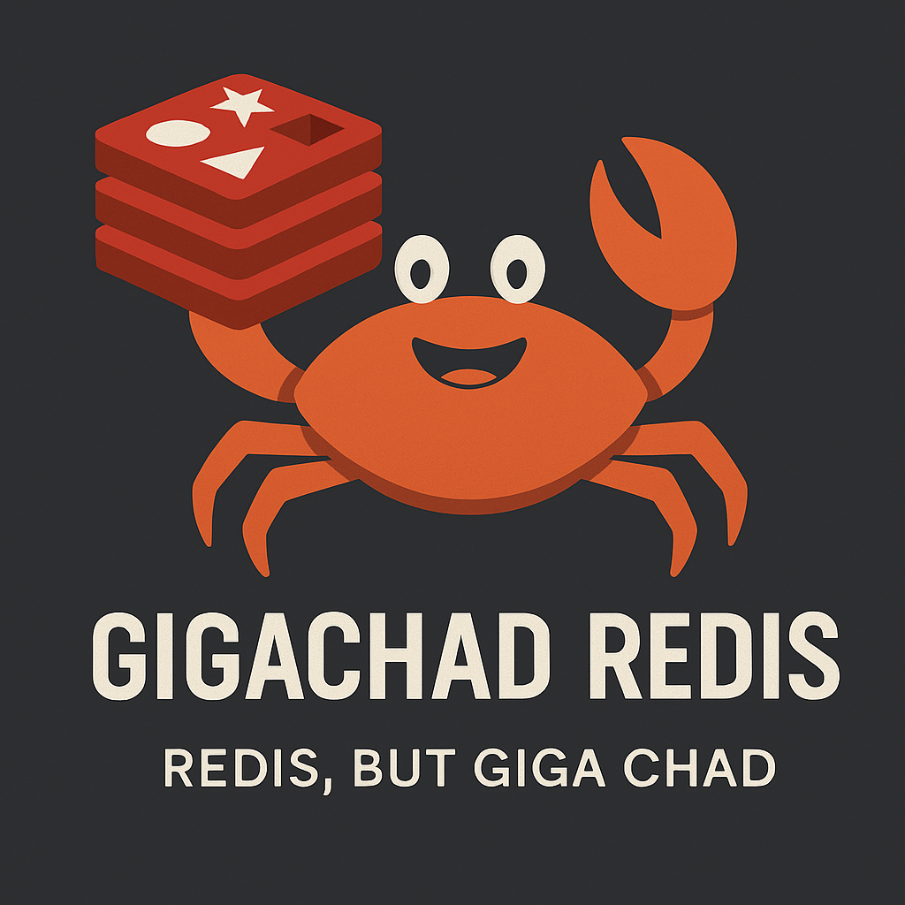

🔥 rizzlerdb — Building Redis from Scratch in Rust

  

A blazing-fast, from-scratch Redis-like server written in Rust.

No frameworks. No shortcuts. Just raw TCP, manual RESP parsing, and pure backend violence.

---

🚀 Architecture Overview

Clients connect via raw TCP on port 6379

Each connection is handled in a new thread (multithreaded)

Incoming commands are parsed using a RESP protocol handler

All data is stored in a central Database struct, protected by Arc<Mutex<_>>

For mutating commands, persistence is triggered through a Persister trait

Current implementation: JsonPersister (writes to db.json)

On startup, server attempts to load existing state from disk

---

✅ Features Implemented

☑ Core Features

[x] Multithreaded TCP server

[x] Manual RESP protocol parser

[x] In-memory data store with Rust HashMap + Vec

[x] Auto persistence with JsonPersister

[x] Load existing state from db.json on boot

☑ Commands

🧠 String Ops

PING, ECHO, SET, GET, DEL, EXISTS, INCR, INCRBY, DECR, DECRBY

⏳ Expiry & TTL

EXPIRE, TTL, PERSIST

🧺 List Ops

LPUSH, RPUSH, LPOP, RPOP, LRANGE

📐Set Ops

SADD, SREM, SMEMBERS, SISMEMBER

🗃️ Hash Ops

HSET, HGET, HDEL, HGETALL

🔍 Other

KEYS with pattern matching (basic globbing)

---

📂 Run It Locally

cargo run

In a separate terminal:

redis-cli -p 6379

Try out:

> SET name gigachad
> GET name
> INCR count
> LPUSH queue task1
> HSET user name yash

---

🔮 Next Phase

What’s next in the evolution of the RizzlerDB:

[ ] Background expiry cleanup workers

[ ] Refactor and modularize the codebase (structure time)

[ ] Pub/Sub (broadcast the gospel)

[ ] Async server with Tokio

[ ] Config file support (customizable ports, persist toggle)

[ ] LRU / LFU eviction strategies

[ ] RDB-style snapshotting

[ ] AOF persistence

[ ] Dockerization for deployment

[ ] Benchmarks vs Redis (for the flex)

[ ] Custom CLI client for rizzlerdb

---

🤔 Why This Project?

Redis is the king of in-memory stores. Rust is a systems beast. Combine both, and you learn internals, low-level programming, system design, and multithreading all at once.

This is a backend villain origin story — raw, educational, and eventually production-grade.

---

📎 Repo

GitHub: github.com/pixperk/redis_in_rust

---

🙏 Credits

Redis Documentation

RESP Protocol Spec

---

Star it ⭐ | Fork it 🍴 | Hack it 🧠 | Rizz it 🦝

